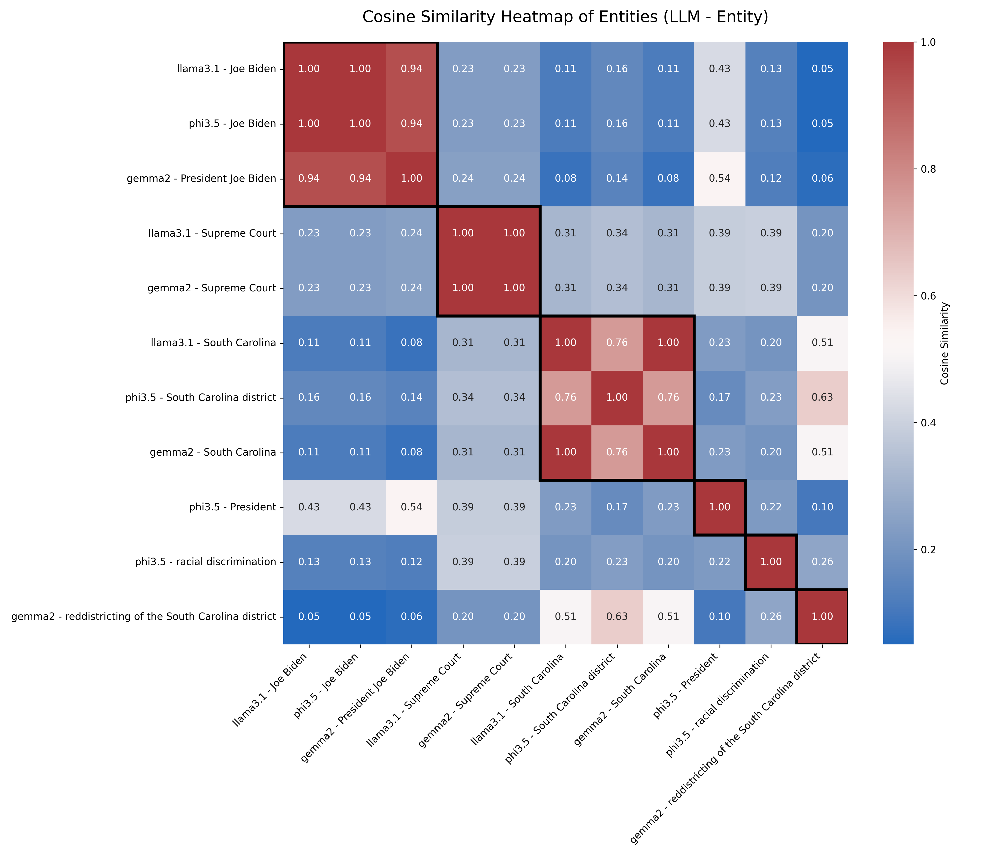

# **LLM Entities Agreement and Extraction**

This repository explores the use of Large Language Models (LLMs) for entity extraction and agreement. It focuses on unifying inconsistent entity lists generated by multiple LLMs into a consistent and reliable output using techniques like cosine similarity and SBERT embeddings.

**Read more about it in my blog titled:** [*2025-01-16: Do Large Language Models Agree on Entity Extraction?*](https://ws-dl.blogspot.com/2025/01/2025-01-16-do-large-language-models.html)

---

## **Repository Structure**

```plaintext
├── .gitignore               # Ignored files and directories
├── LICENSE                  # License file for the project
├── README.md                # Project overview and documentation
├── requirements.txt         # Project dependencies
├── code/                    # Source code for extraction and agreement
│   ├── llm_ner_agreement.py # Script to unify extracted entities using cosine similarity
│   ├── llm_ner_extraction.py# Script to extract entities from multiple LLMs
├── data/                    # Data files for entity extraction and characterization
│   ├── extracted_entities.json                 # Raw entity outputs from LLMs
│   ├── unique_entities_transformer_with_model_entity.json # Unified entities with model-level embeddings
│   ├── unique_entities_transformer.json        # Unified entities with transformer embeddings
│   ├── unique_entities_with_types.json         # Unified entities with associated types
│   └── unique_entities.json                    # Final list of unique entities
├── data/image/              # Visualizations
│   └── cosine_similarity_heatmap_clustered_with_threshold.png # Cosine similarity heatmap
```

---

## **Project Overview**

The project leverages LLMs like Llama 3.1, Phi 3.5, and Gemma 2 to perform Named Entity Recognition (NER) tasks. Each model produces different entity outputs for the same input text, highlighting inconsistencies in entity extraction. To address this, the project applies Sentence-BERT (SBERT) embeddings and cosine similarity to merge similar entities into a unified list while preserving their semantic meaning.

---

## **Key Features**

- **Entity Extraction**:
  - Extract entities and their types using prompts tailored for LLMs.
  - Process outputs from multiple LLMs into a consistent format using regex.

- **Entity Agreement**:
  - Use SBERT embeddings and cosine similarity to unify entity lists.
  - Adjust similarity thresholds to balance merging precision.

- **Visualization**:
  - Generate heatmaps to analyze cosine similarity between extracted entities.

---

## **Setup**

### **1. Clone the Repository**
```bash
git clone https://github.com/bllin001/llm-entities-agreement.git
cd llm-entities-agreement
```

### **2. Create and Activate a Conda Environment**
```bash
conda create --name llm_entities_env python=3.10.14 -y
conda activate llm_entities_env
```

### **3. Install Dependencies**
```bash
pip install -r requirements.txt
```

---

## **Scripts**

### **`llm_ner_extraction.py`**
- Extracts entities and their types from multiple LLMs using predefined prompts.
- Outputs the extracted entities to `extracted_entities.json`.

### **`llm_ner_agreement.py`**
- Processes extracted entities to unify similar ones using SBERT embeddings and cosine similarity.
- Generates unified lists in `unique_entities.json` and `unique_entities_with_types.json`.

---

## **Usage**

1. **Run Entity Extraction**:
   ```bash
   python code/llm_ner_extraction.py
   ```

2. **Run Entity Agreement**:
   ```bash
   python code/llm_ner_agreement.py
   ```

3. **View Outputs**:
   - Extracted entities: `data/extracted_entities.json`
   - Unified entities: `data/unique_entities.json`

---

## **Data**

- **`data/extracted_entities.json`**: Raw entity outputs from LLMs.
- **`data/unique_entities.json`**: Unified list of unique entities.
- **`data/unique_entities_with_types.json`**: Unified entities with associated types.

---

## **Visualization**

The project includes a heatmap visualization showing cosine similarity scores between entities extracted by different models. This helps analyze the degree of similarity and refine thresholds for unifying entities.


### **Cosine Similarity Heatmap**

The following heatmap visualizes the cosine similarity between entities extracted by different LLMs. This helps in understanding the degree of agreement between the models and refining the thresholds for unifying entities.




---

## **Future Directions**

- Improve entity agreement by incorporating temporal and contextual features.
- Develop advanced NER models to better handle ambiguous or overlapping entities.
- Enhance visualizations to include clustering of similar entities.

---

## **License**

This project is licensed under the MIT License. See the `LICENSE` file for details.
